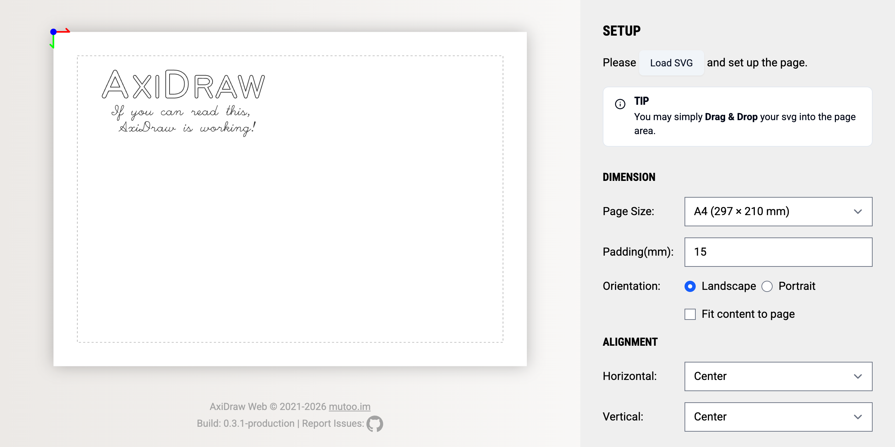
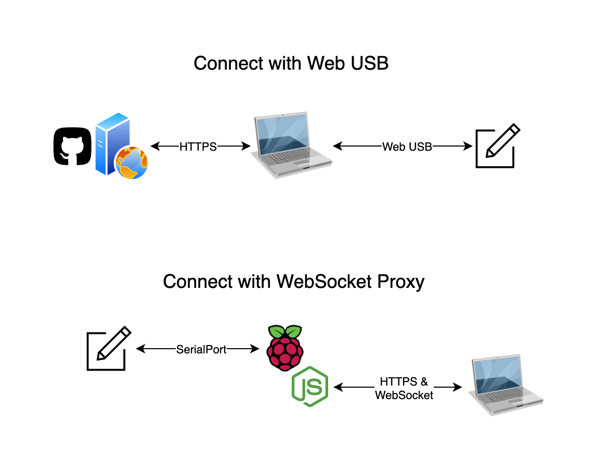

# AxiDraw Web

AxiDraw Web runs an [AxiDraw](https://axidraw.com/) pen plotter from the
browser, with nothing to install. It plots SVG files, sends commands by
hand to the AxiDraw's controller, the EiBotBoard (EBB), and plays music on
its motors. The browser talks to the AxiDraw over WebUSB, or through a
WebSocket proxy on the computer the AxiDraw is plugged into, and a virtual
AxiDraw stands in when there is no plotter at hand.

The latest version runs at **[axidraw.mutoo.im](https://axidraw.mutoo.im)**.



## Apps

### Plotter

The [plotter](https://axidraw.mutoo.im) takes an SVG to paper in three
steps:

1. **Setup.** Load an SVG, or drop it on the page, then choose the page
   size, padding, orientation and alignment, and whether to fit the drawing
   to the page.
2. **Planning.** The drawing is turned into line segments on the page.
   Consecutive segments no further apart than the **Connected** tolerance
   are joined into one stroke, and each stroke is simplified within the
   **Flatten** tolerance, both in mm. **Optimize plotting order** draws the
   nearest stroke next, from whichever end is nearer, to cut pen-up travel.
   The plan is previewed on the page and can be exported as an SVG.
3. **Plotting.** Connect a device and plot at a constant velocity, or with
   acceleration and cornering, with pen-up and pen-down speeds and servo
   positions of your own. The app estimates how long the plot will take. A
   plot can be paused, resumed and stopped from the app, and paused with
   the AxiDraw's PRG button. Between plots, quick commands raise, lower or
   toggle the pen, turn the motors off or reset the EBB.

The plotter reads `path` (every command), `rect` (rounded corners too),
`circle`, `ellipse`, `line`, `polyline` and `polygon` elements, inside
`svg`, `g` and `a` elements, with their transforms. Other elements are left
out.

### Virtual plotter

An emulated AxiDraw, opened from the device connector in a window of its
own. It draws what the pen would draw and hums like the motors would, and
the other apps drive it like a real AxiDraw. Pens come in any color, with
tips from 0.3 to 2 mm, and a 15 cm ruler can lie along the edges of the
paper. A plot can run up to ten times faster than real time, or finish at
once. While it's idle, the carriage can be moved by hand. The paper can be
saved as a PNG or an SVG. See
[docs/virtual-plotter.md](docs/virtual-plotter.md).

### Debugger

The [debugger](https://axidraw.mutoo.im/#debugger) sends EBB commands by
hand: any command the app knows, with its parameters, and the EBB's
response. Each command links to its entry in the command reference for the
connected firmware. The most used commands take a click, and a batch of
commands can be sent in one go.

### Composer

The [composer](https://axidraw.mutoo.im/#composer) plays music on the
plotter, stepping each motor at the pitch of the notes, one channel per
motor ([see it play](https://www.instagram.com/p/CP-K1m9J-j1/)). It comes
with songs that are free to share, loads others from `.song` files, and can
draw with the pen as it plays. See [docs/composer.md](docs/composer.md) and
[docs/composer-notation.md](docs/composer-notation.md).

All the apps share one list of page sizes: ISO A1 to A6 and B4 to B6, US
sizes, cards and art paper, and the plot area of each AxiDraw model.

## Connecting

The plotter, the debugger and the composer share one device connector,
with three ways to connect:

- **USB** talks to the AxiDraw directly over WebUSB, which Chromium-based
  browsers such as Chrome and Edge support. **Pair new device** opens the
  browser's device picker; **Connect** uses an AxiDraw paired before, and
  opens the picker if there is none.
- **WebSocket** goes through the proxy server in this repository, running
  on the computer the AxiDraw is plugged into. See
  [Plotting through the WebSocket proxy](#plotting-through-the-websocket-proxy).
- **Virtual Plotter** opens the virtual plotter, with the firmware version
  and the paper chosen here.



## EBB firmware

AxiDraw Web supports EBB firmware 2.x, and is tested with firmware 2.8.1. It
doesn't support firmware 3.x yet: see [Firmware 3.x](#firmware-3x). Once a
device is connected, the device connector shows its firmware version. The
virtual plotter acts as firmware 2.7.0.

- **2.7.0 to 2.8.1**: everything works.
- **2.6.0 to 2.6.x**: everything but plotting with acceleration, which moves
  with `LM`. The plotter plots at constant velocity.
- **2.4.3 to 2.5.x**: the composer and the debugger work. The plotter can't
  plot, as every plot starts by setting the servo power timeout with `SR`.
- **Before 2.4.3**: AxiDraw Web can't connect.
- **3.0 and later**: not supported yet. AxiDraw Web can't connect.

In the debugger, a command the firmware is too old for fails, and says which
version it needs. Evil Mad Scientist explains
[how to update the firmware](https://wiki.evilmadscientist.com/Updating_EBB_firmware),
and documents the commands of
[firmware 2.x](https://evil-mad.github.io/EggBot/ebb2.html) and
[firmware 3.x](https://evil-mad.github.io/EggBot/ebb.html).

### Firmware 3.x

Firmware 3.x isn't supported yet, as AxiDraw Web can't connect to it.
Connecting sends `R` to reset the EBB, then `V` for its version. Firmware
2.4.3 to 2.8.1 answers `R` with `OK` twice, as the reset clears the step
counters with `CS`, which sends its own `OK`, and AxiDraw Web waits for both.
Firmware 3.0 answers with one `OK`, as firmware before 2.4.3 did, so
connecting fails after 60 seconds with `EBB Command timeout: R`.

Supporting 3.x also means handling a few commands it changes. It keeps the
replies of 2.x unless `CU,10,1` turns on its new ones, which AxiDraw Web
doesn't send, but:

- `QB`, which the plotter and the composer read the PRG button with, is
  deprecated in favour of `QG`.
- `QG` reports other things in bits 6 and 7, which the debugger reads as
  2.x does.
- `PC`, `PG` and `T`, which the debugger offers, are gone.

## Plotting through the WebSocket proxy

When the AxiDraw is plugged into another computer, such as a Raspberry Pi
or a NAS, run the server in this repository there. It serves the app over
HTTPS on port 8443, and passes EBB commands between the browser and the
AxiDraw's serial port. With Node.js and pnpm installed, as for
[development](#development):

```bash
pnpm install
pnpm build
bash ./scripts/create-cert.sh
pnpm run server
```

Then open `https://<host>:8443`, pick **WebSocket** in the device
connector, and connect. The URL defaults to the server's own proxy,
`wss://<host>:8443/axidraw`, and the password to `axidraw-web`. To use
another password, start the server with `AXIDRAW_AUTH` set to it:

```bash
AXIDRAW_AUTH=my-secret pnpm run server
```

The server runs its TypeScript directly on Node.js, with no build step of
its own. On Linux, the user it runs as needs access to the serial port,
usually by being in the `dialout` group. `serialport` uses a prebuilt
binary where one matches the platform, and otherwise compiles one, which
needs a C++ toolchain.

### Certificate

The server only serves HTTPS: browsers allow WebUSB only in a secure
context, and a page loaded over HTTPS can only open secure WebSockets.
[`scripts/create-cert.sh`](scripts/create-cert.sh) creates a certificate
authority, and a certificate signed by it for the server, in `server/cert`:

- `ca.pem` is the authority's certificate. Import it on each computer the
  app is used from, into the system or the browser, and trust it for SSL.
  The server offers it for download at `https://<host>:8443/ca`.
- `localhost.crt` and `localhost.key` are the server's. The certificate
  covers `localhost`, the host name that the `hostname` command prints,
  and `*.nip.io`. To reach the server by its IP address, use
  [nip.io](https://nip.io) with dashes in place of the dots, as `*.nip.io`
  covers a single label: `https://192-168-3-14.nip.io:8443` for
  192.168.3.14.

`server/cert` holds private keys, so git ignores it.

## Development

AxiDraw Web is a React and TypeScript app, built with Vite. It needs
Node.js 24 (see [`.nvmrc`](.nvmrc)) and pnpm 12.

```bash
pnpm install
pnpm dev
```

`pnpm dev` serves the app at http://localhost:5173. The other scripts:

| Script            | What it does                                    |
| ----------------- | ----------------------------------------------- |
| `pnpm test`       | Runs the unit tests with Vitest.                |
| `pnpm lint`       | Lints the code with ESLint.                     |
| `pnpm build`      | Type-checks the code and builds it into `dist`. |
| `pnpm preview`    | Serves the build at http://localhost:4173.      |
| `pnpm run server` | Runs the HTTPS server and the WebSocket proxy.  |

A pre-commit hook lints the staged TypeScript files and fixes what it can.
Analytics stay off unless `VITE_GA` is set to a Google Analytics
measurement ID, for example in `.env.local`.

### Layout

| Path                | What's there                                                      |
| ------------------- | ----------------------------------------------------------------- |
| `src/containers`    | The apps: plotter, virtual plotter, debugger and composer.        |
| `src/communication` | Device connections (WebUSB, WebSocket, virtual) and EBB commands. |
| `src/plotter`       | SVG to lines, motion planning, speed profiles and time estimates. |
| `src/components`    | UI the apps share, such as the device connector.                  |
| `server`            | The HTTPS server and the WebSocket proxy.                         |
| `docs`              | Documentation.                                                    |

### Deployment

The site is published to GitHub Pages by the
[deployment workflow](.github/workflows/build-and-deploy-to-github-pages.yml),
which is run by hand.

## Documentation

- [Virtual plotter](docs/virtual-plotter.md): its window, free mode, the
  EBB commands it knows, and how it talks to the main window.
- [Composer](docs/composer.md): playing a song, and how the player sends it
  to the EBB.
- [Composer notation](docs/composer-notation.md): the note notation,
  writing songs, and song files.
- [R-tree](docs/rtree.md): the spatial index behind the plotting order, and
  the measurements behind its design.

## License

AxiDraw Web is released under the [MIT License](LICENSE).

## Acknowledgements

Thanks to [Evil Mad Scientist](https://www.evilmadscientist.com/) for the
AxiDraw. The project began as a take on
[saxi](https://github.com/nornagon/saxi) that runs in the browser, with no
Node.js project to install.
