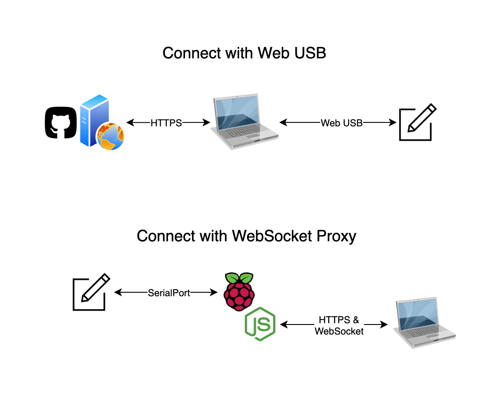

# Axidraw-Web

This project is work-in-progress!


Axidraw-Web allow artists to connect [AxiDraw](https://axidraw.com/) in the browser with the WebUSB API. Or connect to remote AxiDraw with WebSocket proxy. You may also enjoy plotting on a virutal AxiDraw in the browser if you don't have a physical one.



## TODOs

Checkout more on the [project board](https://github.com/mutoo/axidraw-web/projects/1).

### Communication Interface

- [x] EBB Communication via WebUSB
- [x] EBB Communication via WebSocket
- [x] EBB Command Debugger
- [x] EBB Virtual Plotter

### Plotter App

- [x] SVG load and preview
- [x] SVG path parser
- [x] SVG elements to line segments
- [x] Motion Planning (simple)
- [x] Motion Planning (reorder)
- [x] Plotting (constant speed)
- [x] Plotting (acceleration mode)
- [x] Plotting control (pause/resume/stop)
- [ ] Plot skipping/seeking

### Composer

- [x] A singing pen plotter, [it's real.](https://www.instagram.com/p/CP-K1m9J-j1/)

### Virtual AxiDraw

- [x] Run a virtual AxiDraw in the browser
- [x] Generate motor sounds as the pen moving
- [ ] Free-mode Position control
- [ ] Color control
- [ ] Size control

## Play it on browsers:

The latest version is deployed at https://axidraw.mutoo.im , you don't need to install any software or plugins to use it. Just open the website and plug the AxiDraw on your machine to plot any svg with it.

### Other Apps

Try the [Debugger](https://axidraw.mutoo.im/#debugger) if you want to play with low-level ebb command.

Try the [Composer](https://axidraw.mutoo.im/#composer) if you wondering how the pen plotter singing.

## Run locally

Make sure you have `node v20+` and `pnpm` installed. Then checkout the repo and run `pnpm i` to install all the dependencies.

```
$ pnpm dev
```

## Run remotely

Sometime you want to use the AxiDraw connected to a raspberry pi or NAS, you can run the server on the remote machine and connect to it via WebSocket.

You will need to build the project first, and then run the server with a self-signed cert:

```
$ pnpm build
$ bash ./scripts/create-cert.sh
$ node server/index.js
```

### Self-signed cert

In order to use WebUSB on the browser, you'll need to make it in a secure contexts. The localhost is considered a secure context, but the LAN address is not. So if you want to run it via LAN, you have to generate a self-signed cert on your own:

```
$ bash ./scripts/create-cert.sh
```

This command will generate a `CA.pem` and `localhost.crt` in the `server/cert` folder.

Please import the `CA.pem` to your system or browser and trust it for Secure Sockets Layer (SSL).

The local server will use the `localhost.crt` and `localhost.key` to host the website at:

```
https://localhost:8443
```

The cert generation script will also provide extra DNS including your hostname, and a wildcard dns address with your LAN ip (in case you don't have mDNS service in your OS):

```
# e.g. your hostname is raspberry-pi.local
# and your LAN ip is 192.168.3.14
https://raspberry-pi.local:8443
https://192.168.3.14.nip.io:8433
```

N.B. The certificate can be download at from browser.

```
htps://<Device-IP>:8443/ca
```

This very handy when you run the web server on Raspberry PI or other computer and access it at your work device.

### Production build

To run production build locally, run the `pnpm build` to build the and, and then `pnpm preview` to start the web server:

```
$ pnpm build
$ pnpm preview
```

Then visit the app in your browser with links listed in the section above.

### Development build

Feel free to run dev build if you like to inspect how the app work with devTools:

```
$ pnpm dev
```

it will run a dev server at `https://localhost:5173`, which will popup automatically in your browser.

## Run on Raspberry PI

What if you plug in the axidraw on a Raspberry PI? No problem! This app also provide a proxy mode via WebSocket, so that you can run a web server to communicate the axidraw and your browsers in different computers.

N.B. The serialport/usb permission has to be set up so that the server can communicate with the device.

## License

MIT

## Credits

Thanks [Evil Mad Scientist](https://www.evilmadscientist.com/) for providing such a great machine to play with.

This project is initially inspired by [saxi](https://github.com/nornagon/saxi). That I want to build a Web App like this without install a node project locally.
